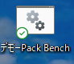
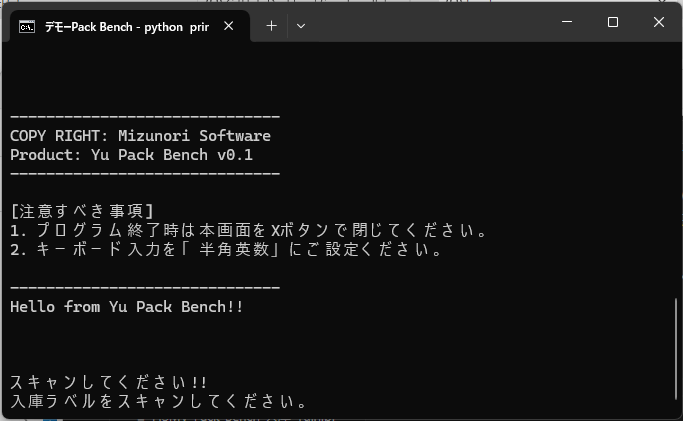

### Pack Bench（HID） デモガイド


### デモ手順
</br>

1. デスクトップのアイコンを実行する。

    

    </br>

1. デモプログラムが起動される。
    
    

    </br>

1. アプリが選択された状態で、入庫ラベルをFS10でスキャンする。

    ```
    スキャンしてください!!
    入庫ラベルをスキャンしてください。4911111000222

    2024-03-07 14:11:48.527747
    4911111000222 がスキャンされました。
    出庫ラベルを印刷されたら、ボックスに貼付してください。
    ```
    </br>

1. 対応した出庫ラベルが印刷される。

    </br>


### 環境構築手順（FS/MV)

1. FS/MVからWinPCに対してHID出力されるように設定する。


### 環境構築手順（Windows PC)

1. Python3をインストールする。
  https://www.python.org/downloads/release/python-3120/

  *  "Add Path"を有効化しておくこと。

1. zebra Libraryをインストール

    ```
    C:\Users\xxxxx>pip install zebra
    Requirement already satisfied: zebra in c:\users\xxxxx\appdata\local\packages\pythonsoftwarefoundation.python.3.11_qbz5n2kfra8p0\localcache\local-packages\python311\site-packages (0.1.0)
    Requirement already satisfied: pywin32 in c:\users\xxxxx\appdata\local\packages\pythonsoftwarefoundation.python.3.11_qbz5n2kfra8p0\localcache\local-packages\python311\site-packages (from zebra) (306)
    ```

1. デモアプリの起動

    ```
    start-demo.bat
    ```
    ※アプリは必ずフロントに出しておくこと。
